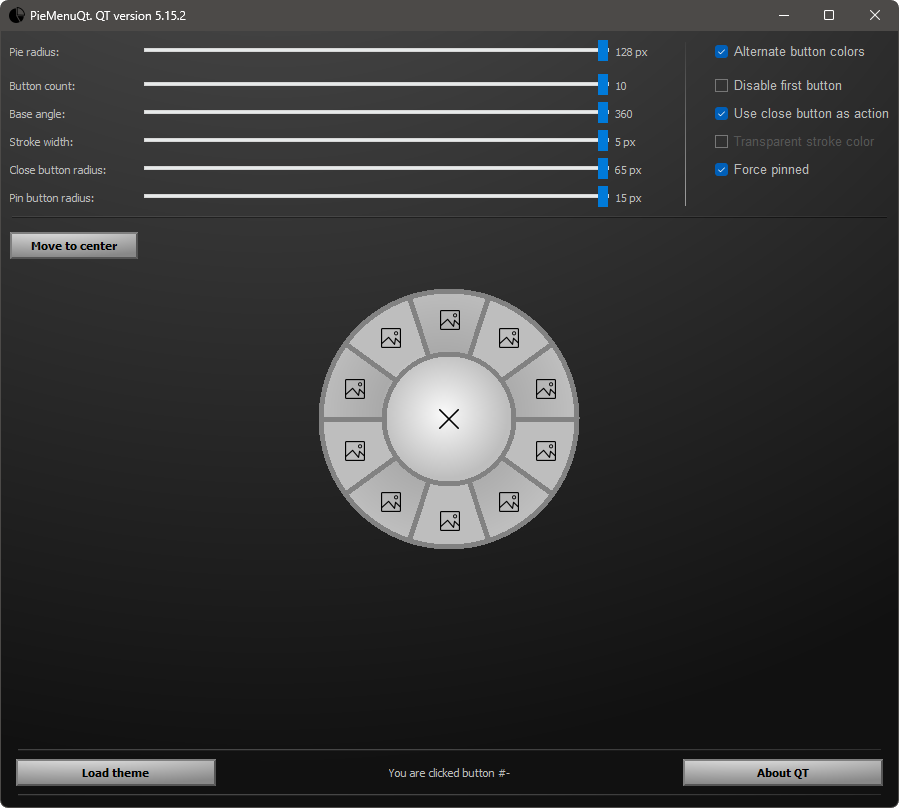
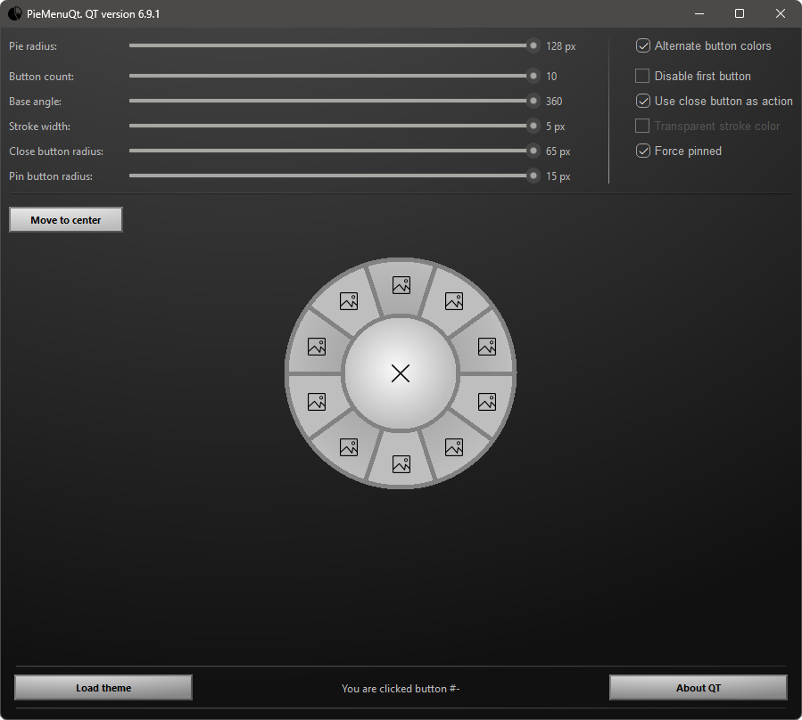

# A pie menu implementation for Qt

This is a fully customizable pie menu implementation based on QWidget that allows for arbitrary amounts of buttons, disabled buttons, button icons and appearance customization.
 
It includes an optional pin/unpin button that, when activated, keeps the pie menu open until it is manually or programmatically closed.

*A demo program for the pie menu that allows setting of multiple parameters*

## FAQ
### How do I integrate piemenu-qt into my software?

To integrate piemenu-qt into your program, you only need the PieMenu.h and PieMenu.cpp files. Just include them in your qmake / CMake makefile and instantiate the component in code. You can initialize the pie menu as seen in initPieMenu() in the demo program.

Configure the pie menu by setting the member variables to your liking. You can probably remove most of the setter functions as they are primarily used by the demo program to set properties after instantiation.

Some properties like stroke and brush colors can be changed directly in the PieMenu.cpp functions. Feel free to modify the implementation to fit your needs.

### Can I assign text to the PieMenu buttons?

The current implementation only supports icon buttons but you can modify it to display text instead by replacing the drawPixmap() calls with drawText(). Just keep in mind that the space inside the buttons is limited, depending on the overall widget size.

### Which versions of Qt are supported?

Adopted for QT 5+. Window title contains QT version.

Qt5| Qt6
------------ | ------------
 | 

### I have found a bug or got an improvement idea, what do I do?

In that case, feel free to open an issue here on GitHub or even open a pull request with your improved code. I will have a look at it so we can make the widget better for everyone.
